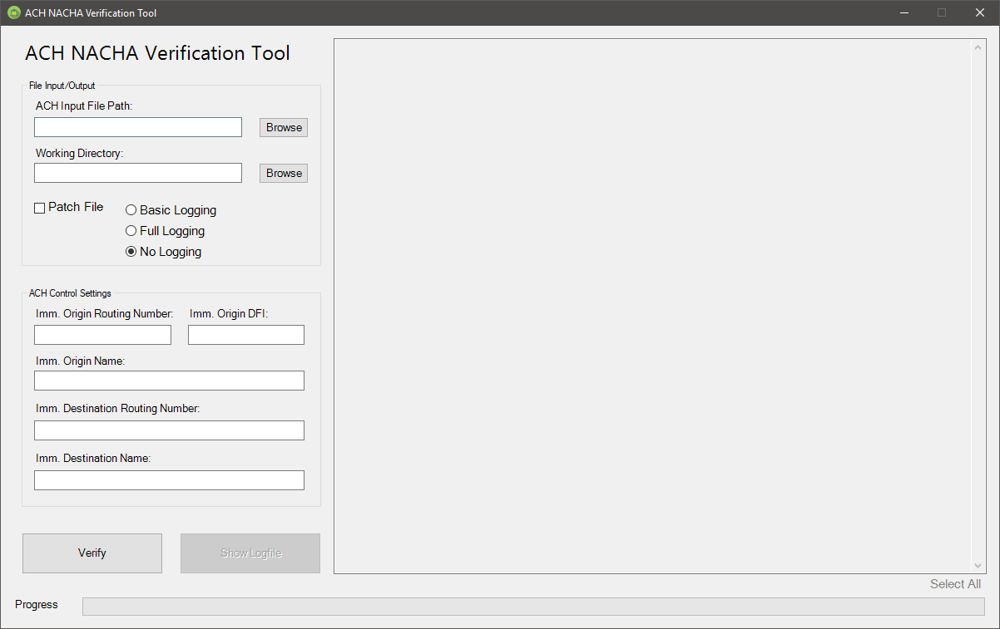

<h1 align="center">
  <br>
  <a href="https://github.com/joshuanasiatka/ACH-Verify-Tool"></a>
  <br>
  ACH Verification/Patch Tool
  <br>
</h1>

<h4 align="center">Patch ACH files and generate detailed breakdown reports of fields and issues</h4>

<p align="center">
    <a href="https://github.com/joshuanasiatka/ACH-Verify-Tool/archive/master.zip">
      
    </a>
    <a href="https://github.com/joshuanasiatka/ACH-Verify-Tool/issues">
      
    </a>
    <a href="https://github.com/joshuanasiatka/ACH-Verify-Tool/pulls">
      
    </a>
    <a href="https://github.com/joshuanasiatka/ACH-Verify-Tool/releases">
      
    </a>
    <a href="https://www.gnu.org/licenses/lgpl-3.0">
      
    </a>
</p>

<p align="center">
  <a href="#key-features">Key Features</a> •
  <a href="#installation">Installation</a> •
  <a href="#how-to-use">How To Use</a> •
  <a href="#automation">Automation</a> •
  <a href="#built-with">Built With</a> •
  <a href="#license">License</a> •
  <a href="#acknowledgements">Acknowledgements</a>
</p>



## Key Features

- Written in PowerShell
- Supports command line and GUI
- Automatically fixes issues with ACH files
- Gives detailed report of issues, record by record
- Supports 1, 5, 6, 8, and 9 records
- Verifies that origin and destination routing numbers exist

## Installation

This application installs into AppData for the user that runs the `install.bat` file. There will be files in the following directories:

- C:\Users\<username>\AppData\Local\POSHTools\Verify-ACH
- C:\Users\<username>\AppData\Roaming\Microsoft\Windows\Start Menu\Programs\ACH Tools
- C:\Users\<username>\Desktop

*Note: the application doesn't need to install, you can run it from the source directory, but the previous parameters used when running the application will save into the AppData folder of the user running the application on close.*

### Option 1: Zip and Batch File

1. Download the [latest version](https://github.com/joshuanasiatka/ACH-Verify-Tool/archive/master.zip) of the source code
2. Extract the zip file.
3. Double-click the `install.bat` file.

I haven't signed any of the scripts, so you may have to unblock the scripts in file properties.

### Option 2: From Source

```powershell
PS> Write-Warning "I haven't written a script for this yet"
```

## How To Use

*ACH Verify* can be run either as a GUI or via command line, the command line allows for automating ACH patching jobs.

### Graphical Interface

For quickly verifying accuracy and fixing an ACH file, your best bet is to use the graphical interface (GUI). Assuming you've installed the application, go ahead and launch the application from either the start menu or desktop shortcut.

When you launch it for the first time, all fields will be empty. 

1. Next to the "ACH Input File Path" field there is a browse button, browse to the `*.ach` or `*.txt` file. *Note: If you type the beginning part of the path and then click browse, it will open the browse window at the location.* A green checkmark should appear next to it if it can access the file.
2. Next specify the Working Directory. This is where any logging or patched ACH files will save to. You can either type in the path, paste it, or click browse. It will show a green checkmark if it can access it.
3. To automatically patch the file and output it into the working directory path provided, check the "Patch File" checkbox.
4. Under ACH Control settings, type in the Immediate Origin Routing number, this is normally the institution. The ODFI and name will automatically populate if the routing number is correct. This verifies against an API.
5. Do the same for the Immediate Destination, it will also verify if it exists. If you use a different Destination Name than what populates, e.g. FRB BOSTON instead of FEDERAL RESERVE BANK, you can change it.
6. Then click "Verify".

The application will now process the ACH file correcting for any errors and output those on the right. When you close the application, all fields will save for the next time you need to verify an ACH file.

*Note: The logging options are currently only working when using application via command line, I'm working to resolve this.*

#### Bonus Module

Part of the source code is an ABA Routing Number verification tool which is integrated into the *ACH Verify* GUI. You can run the ABA test separately, again as either command line or GUI. 

This is located in `C:\Users\<username>\AppData\Local\POSHTools\Verify-ACH\Application\Test-ABA` or if not installed, the `Test-ABA\` folder within the downloaded source folder, and can be run by executing the `ABAChecker.ps1` script. Without arguments, it will open the GUI.

When running it separately from *ACH Verify*, there is only one command line argument to use and that is `-RoutingNumber`. Pass in the 9-digit routing number and it will make a call to the [Routing Numbers](https://www.routingnumbers.info/) API. The result sent from the API is JSON but is converted to a `[PSCustomObject]` like so:

```
PS C:\Users\user1\AppData\Local\POSHTools\Verify-ACH\Application> .\Test-ABA\ABAChecker.ps1 -RoutingNumber 011000015


message                 : OK
code                    : 200
address                 : 1000 PEACHTREE ST N.E.
rn                      : 011000015
city                    : ATLANTA
routing_number          : 011000015
zip                     : 30309-4470
customer_name           : FEDERAL RESERVE BANK
state                   : GA
record_type_code        : 0
new_routing_number      : 000000000
change_date             : 122415
telephone               : 877-372-2457
office_code             : O
institution_status_code : 1
data_view_code          : 1
```

### Command Line

Running the script with parameters has its benefits, including getting a breakdown report of all records, fields, and encountered field validation errors. This will be integrated into the graphical interface soon. 

> One quick thing to note about the report, due to how wide the report is, for best results when printing, open the log file in [Google Chrome](https://www.google.com/chrome/) and print landscape on legal at 63% zoom, the text will look small but still legible on paper.

The script supports the following useful arguments:

| Argument        |   Type    | Required | Description                                                                |
|-----------------|:---------:|:--------:|----------------------------------------------------------------------------|
| `-ACHFileName`  |  String   |   Yes    | Complete path to `.ach` or `.txt` file (can be any plaintext filetype)     |
| `-FileHeader`   | Hashtable |   Yes    | Immediate Origination and Immediate  Destination routing numbers and names |
| `-OutputFolder` |  String   |    No    | Path to output directory, default is same as ACH                           |
| `-Patch`        |  Switch   |    No    | Append if you want the ACH file corrected, don't for just log of issues    |

The `-FileHeader` is required to validate the routing numbers, odfi, and names of the origin and destination institutions. If you would rather not specify this every time or if it doesn't change. In the `Verify-ACH.ps1` script, there is a `$settings` `[hashtable]` variable, just update that with the values you want to use as defaults. If only some fields change, such as `company_name` or `immediate_origin`, you would only need to specify those as part of the `-FileHeader` `[hashtable]` parameter.

**Sample:**
```powershell
# example: originating ach from BNY MELLON through FRB BOSTON
$header = @{
    'immediate_destination'         = '011000015' # FED BOSTON
    'immediate_destination_name'    = 'FRB BOSTON'
    'immediate_origin'              = '021000018' # BANK OF NY MELLON
    'immediate_origin_name'         = 'BK OF NYC'
    'company_name'                  = 'BNY MELLON'
}
```

**A script call would then be:**
```powershell
PS> .\Verify-ACH.ps1 -ACHFileName C:\Temp\ACH\bad_file.ach -FileHeader $header -OutputFolder C:\Temp\ACH\Output -Patch
```

**Or something a little cleaner and complete:**
```powershell
$parameters = @{
  ACHFileName  = 'C:\Temp\ACH\bad_file.ach'
  FileHeader   = @{
    'immediate_destination'         = '011000015' # FED BOSTON
    'immediate_destination_name'    = 'FRB BOSTON'
    'immediate_origin'              = '021000018' # BANK OF NY MELLON
    'immediate_origin_name'         = 'BK OF NYC'
    'company_name'                  = 'BNY MELLON'
  }
  OutputFolder = 'C:\Temp\ACH\Output'
  Patch        = $True
}

.\Verify-ACH.ps1 @parameters
# this will log all details into the output directory with the fixed ach file
```

## Automation

If you will regularly patch ACH files if someone just can't get it right or if you just want to automate sending the breakdown report of records and fields, it can be automated.

Open to interpretation and creativity on how to do this, but here is an example on how you could automate the reports:

### Example

1. Set up a central working directory on a share somewhere (e.g. `\\FILESERVER01\Automation\ACH`).
2. In that folder create three folders: `src`, `input`, `output`.
3. Download the source code and extract it into that src folder.
4. Using an automation scheduler such as "Task Scheduler" or "VisualCron", you can then poll that `\input\` folder for changes and read the contents of the folder either with a native VisualCron trigger or task or with PowerShell via `Get-ChildItem`.
5. Then create a `Foreach-Object` interator over the list of files and run that against the `-ACHFileName` parameter and set the output to the `\output\` folder.
6. Then the Immediate Originating and Destination routing numbers and names will need to be specified in a `[hashtable]`.
   ```powershell
   $FileHeader   = @{
     'immediate_destination'         = '011000015' # FED BOSTON
     'immediate_destination_name'    = 'FRB BOSTON'
     'immediate_origin'              = '021000018' # BANK OF NY MELLON
     'immediate_origin_name'         = 'BK OF NYC'
     'company_name'                  = 'BNY MELLON'
   }
   ```
7. If you want to automate patching the file, specify the `-Patch` parameter.

All together you would then have something like this with a file or time trigger to poll the folder:
```powershell
$files = (Get-ChildItem -Path "\\FILESERVER01\Automation\ACH\Input\*" -Include *.ach, *.txt) | Select-Object -ExpandProperty FullName

$files | %{
  $parameters = @{
    ACHFileName  = $_
    FileHeader   = @{
      'immediate_destination'         = '011000015' # FED BOSTON
      'immediate_destination_name'    = 'FRB BOSTON'
      'immediate_origin'              = '021000018' # BANK OF NY MELLON
      'immediate_origin_name'         = 'BK OF NYC'
      'company_name'                  = 'BNY MELLON'
    }
    OutputFolder = "\\FILESERVER01\Automation\ACH\Output"
    Patch        = $True
  }
  
  .\Verify-ACH.ps1 @parameters
}
```

## Built With

* [Routing Numbers API](https://www.routingnumbers.info/) - API used for testing existence and pulling information for routing numbers.

## License

This project is licensed under the GNU General Public License v3 (GPLv3) - see the [LICENSE.md](LICENSE.md) file for details. This license is subject to change without notice.

## Acknowledgements

- Logos and icons are from [Icon Archive](http://www.iconarchive.com/) and are licensed for free and commercial use.
